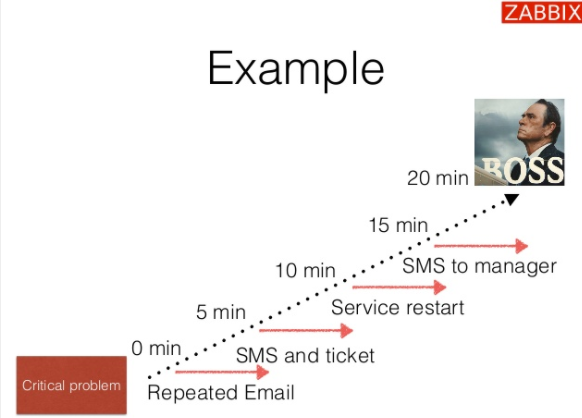
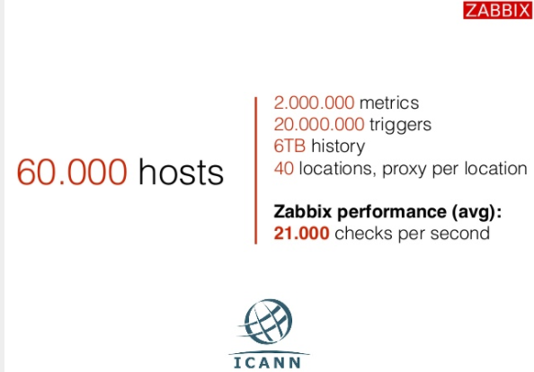

# Zabbix 5.0

* Là giải pháp giám sát cấp doanh nghiệp mã nguồn mở phổ biến
* Có thể giám sát 100.000 thiết bị
* Có thể thu thập lượng dữ liệu lịch sử hằng ngày lên đến mức **TB**
## Điều gì mà Người dùng nên chọn Zabbix
**ALL-IN-ONE**: Tất cả trong một giải pháp mang tên Zabbix

### Lợi ích của Zabbix
* Tất cả các nền tảng giám sát phổ biến nhất được gói gọn trong Zabbix
* Miễn phí- Là nền tảng mã nguồn mở được support toàn cầu 
* Dễ dàng sử dụng các dịch vụ thương mại nếu cần
* GPL-2.0 License- Không mất phí giấy phép 
* TCO low- quá trình duy trì sử dụng ít tốn kém về chi phí
* No vender lock in - nhà cung cấp không bao giờ khóa
## Kiến trúc của Zabbix

### Dễ dàng bảo trì
* Tất cả các thành phần đều tương thích trong một bản phát hành chính thức
* Zabbix Agent tương thích kể từ phiên bản Zabbix 1.0

## Các mức của kiến trúc
* Layer Hardware: Là phần cứng của máy chủ

* OS: Zabbix hỗ trợ các hệ điều hành Unix, Linux, Mac, AIX(IBM), Solaris(SUn/Oracle), Window, FreeBSD, OpenBSD,...
* Network: Zabbix hỗ trợ giam sát các thiết bị có kết nối mạng
* Virtual layer:
* Middleware: Các phần mềm trung gian mà có thể giám sát
* Business applications: Các ứng dụng mà khách hàng phải phụ thuộc.
## Distributed environment

Zabbix cung cấp một cách hiệu quả và đáng tin cậy để giám sát hạ tầng CNTT Distributed bằng Zabbix Proxy.

Proxy có thể được sử dụng để sử dụng để thu thập dữ liệu cục bọ thay mặt cho Zabbix server và sau đó báo cáo dữ liệu cho máy chủ. Proxy có thể tự đảm bảo thu thập dữ liệu và giảm tải cho máy chủ Zabbix

Một Proxy Zabbix có thể được sử dụng để:
* Giám sát các vị trí từ xa.
* Giảm tải máy chủ Zabbix khi giám sát hàng nghìn thiết bị.
* Đơn giản hóa việc giám sát phân tán

Proxy chỉ yêu cầu một kết nối TCP với máy chủ Zabbix, như vậy việc sử dụng tường lửa sẽ dễ dàng hơn vì bạn cần cấu hình một quy tắc cho tường lửa
>**Chú ý**: Zabbix Proxy phải được sử dụng một cơ sở dữ liệu riêng biệt. Trỏ nó vào cơ sở dữ liệu máy chủ Zabbix sẽ bị phá vỡ cấu hình

## Giao thức thu thập dữ liệu

Có 2 phương pháp được Zabbix sử dụng để lấy thông tin từ các Agent: **Push** & **Pull**
### Pull 
* **Service checks:** HTTP, SSH, IMAP, NTP and other
* **Passive agent**: 
* Script execution ia SSH and Telnet
### Push
* Active check
* Zabbix Trapper and SNMP traps
* Monitoring of log file and event logs on windows

## Tần suất thực hiện kiểm tra
* Cứ mỗi N giây, down to 1 check per second 
    * Zabbix sẽ phân phối đồng đều kiểm tra
* Tuần suất khác nhau trong khoảng thời gian khác nhau - Different frequency in different time period
    * Mỗi X giây trong khoảng thời gian làm việc
    * Mỗi X giây trong vào cuối tuần
* Vào một thời điểm cụ thể
    * Sẵn sàng để kiểm tra công việc
    * Bắt đầu 9:00 giờ vào làm việc
## Mã hóa và xác thực
Mã hóa và xác thực mạnh mẽ cho tất cả các thành phần dựa trên TLS(Transport Layer Security- Bảo mật lớp Transport là một giao thức lớp Upper(ULP) chạy trên TCP. TLS cung cấp tính toàn vẹn và bảo mật của dữ liệu đầu cuối)

## Sensors & Small devices
### Problem detection - Phát hiện sự cố
Làm thế nào để phát hiện sự cố trong luồng dữ liệu? 

Làm thế nào để loại bỏ cảnh báo lỗi?

Xác định đúng các điều kiện của vấn đề và đúng ý mà vẫn an toàn
* Tận dụng history
* Phân tích History

Khác biệt sự cố biến mất và sự cố được giải quyết

Hysteresis 

No Flapping

Trigger - Định nghĩa vấn đề

Nhận diện các vấn đề
* anomaly detection: Phát hiện bất thường

Compare with a norm, where norm is systemc state in the past

Average number ò transactions per second for the last hour is 2x less than number of transactions per second for same period week ago 

So sánh với một tiêu chuẩn, là trạng thái hệ thống trong quá khứ 

Số lượng giao dịch trung bình mỗi giây trong giờ qua ít hơn 2 lần so với số lượng giao dịch trong mỗi giây cùng kỳ tuần trước

* Problem forecasting: Dự báo sự cố
* Trend Prediction: Dự đoán các xu hướng

Cách Zabbix phản ứng với các vấn đề 

* Possible reactions- phản ứng có thể xảy ra 
    * Tự động giải quyết vấn đề
    * Gửi một thông điệp cho user hoặc user group
    * Mở ticket trong nhân viên hỗ trợ hệ thống
    * Không giới hạn số lượng phản ứng có thể xảy ra
* Leo thang- escalation 
    * Phản ứng tức thì:
    * Phản ứng trì hoãn
    * Thông báo nếu hành động tự động failed
    * Thông báo đã lặp lại
    * Leo thang lên một cấp độ mới

điều gì sảy ra nếu có nhiều vấn đề?

Event correlation- Tương quan sự kiện

* Các sự kiện có vấn đề, trùng lặp, lọc sự kiện, phân tích nguyên nhân cho root

scalability -Khả năng mở rộng

Zabbix with ICANN(tập đoàn Internet cấp số và tên miền, và là cơ quan quản lý Internet)

## Vòng đời của Zabbix
* 1 Bản phát hành chính thức 6 tháng 1 lần
* 1 version LTS(long term support) chính thức trong 1.5 Năm

Tần suất phát hành của Zabbix liên tục

Các bản phát hành đang được Zabbix hỗ trợ hiện tại

Nguồn tham khảo 
* [Zabbix](https://www.zabbix.com/documentation/)
* [SLIDESHARE](https://www.slideshare.net/Zabbix/alexei-vladishev-zabbix-monitoring-solution-for-everyone)