# Zabbix 5.0
1. [Giới thiệu tổng quan](#1)

    1.1 [Zabbix là gì?](#1.1)

    1.2 [Lịch sử hình thành và phát triển](#1.2)

    1.3 [Vòng đời của Zabbix](#1.3)

2. [Tính năng của Zabbix](#2)
3. [Lợi ích của Zabbix](#3)
4. [Kiến trúc và cơ chế](#4)

    4.1 [Các mức của kiến trúc](#4.1)

    4.2 [Môi trường giams sát phân tán](#4.2)

    4.3 [Giao thức thu thập dữ liệu](#4.3)

    4.4 [Tần suất thực hiện kiểm tra](#4.4)

    4.5 [Mã hóa và xác thực](#4.5)

## Giới thiệu tổng quan

### Zabbix là gì?
* Là giải pháp giám sát **máy chủ** và **dịch vụ** doanh nghiệp mã nguồn mở phổ biến
* Có thể giám sát 100.000 thiết bị
* Có thể thu thập lượng dữ liệu lịch sử hằng ngày lên đến mức **Terabyte**
* Zabbix là phần mềm giám sát nhiều thông số của mạng cũng như tình trạng và tính toàn vẹn của máy chủ.
* Được truy cập thông qua giao diện người dùng dựa trên Web
* Cảnh báo được gửi qua: Telegram, Email, SMS, Call, Slack...

### Lịch sử hình thành và phát triển.

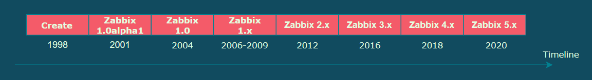

* Zabbix bắt đầu như một dự án phần mềm nội bộ vào năm 1998. Sau ba năm, vào năm 2001, nó được phát hành ra công chúng theo GPL, ba năm sau cho đến khi phiên bản ổn định đầu tiên, 1.0, được phát hành vào năm 2004.
* 2012 phát hành Zabbix 2.0 Long Term Support (LTS) phiên bản hỗ trợ dài hạn
* Tiếp theo là các phiên bản Zabbix 3.0 LTS-2016, 	Zabbix 4.0 LTS-2018, Zabbix 5.0 LTS-2020. 

### Vòng đời của Zabbix

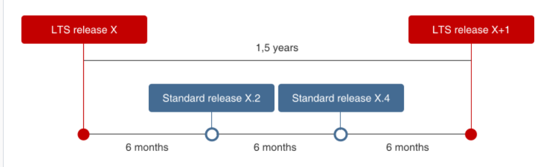

* 1 Bản phát hành chính thức 6 tháng 1 lần
* **Version LTS**(Long Term Support) chính thức trong 1.5 Năm

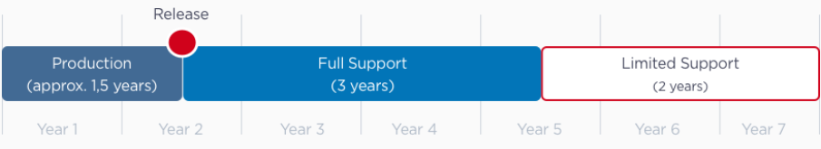

Tần suất phát hành của Zabbix liên tục

Các bản phát hành đang được Zabbix hỗ trợ hiện tại

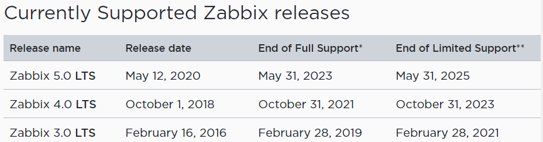

## Các tính năng của Zabbix
Zabbix là một giải pháp giám sát mạng tích hợp và cung cấp nhiều tính năng.

* **Thu thập dữ liệu**
    * Kiểm tra tính khả dụng và hiệu suất 
    * Hỗ trợ SNMP, IPMI, LMX, giám sát VMware 
    * Kiểm tra tùy chỉnh
    * Thu thập dữ liệu mong muốn ở các khoản thời gian tùy chỉnh
    * Được thực hiện bởi máy chủ server/proxy và agent

* **Cấu hình ngưỡng cảnh báo linh hoạt**

* **Cấu hình cho cảnh báo**: Các thông báo có thể được tùy chỉnh cho lịch trình báo cáo, người nhận, media type.
* **Đồ thị thời gian thực**: Các items được giám sát được lập biểu đồ bằng chức năng vẽ đồ thị tích hợp
* **Khả năng giám sát web**: Zabbix có thể theo dõi đường dẫn của các cú nhấp chuột mô phỏng trên trang web và kiểm tra chức năng cũng như thời gian phản hồi.
* **Các tùy chọn hình ảnh hóa mở rộng**
    * Khả năng tạo biểu đồ tùy chỉnh có thể kết hợp nhiều mục vào một chế độ xem duy nhất
    * Network map
    * Màn hình tùy chỉnh và trình chiếu để có tổng quan kiểu bảng điều khiển 
    * Báo cáo
* **Lưu trữ dữ liệu lịch sử**
    * Dữ liệu được lưu trữ trong cơ sở dữ liệu
    * Lịch sử có thể được cấu hình
    * Được xây dựng sẵn khả năng dọn dẹp

* **Cấu hình dễ dàng**
    * Thêm các thiết bị được giám sát làm máy chủ
    * Máy chủ được chọn để theo dõi, một khi trong cơ sở dữ liệu
    * Áp dụng mẫu cho các thét bị được giám sát
* **Sử dụng các Templates**
    * Nhóm lại các checks Templates
    * TemPlate có thể thừa kế từ Templates khác
* **Discovery Network**
    * Tự động Discovery các thiết bị mạng
    * Tự động đăng ký các agent
    * Discovery hệ thống tệp, Giao diện mạng và SNMP OID
*  **Giao diện web nhanh gọn**:
    * Một giao web được xây dựng bởi PHP
    * Có thể truy cập từ mọi nơi
    * audit log

Điều gì mà Người dùng chọn Zabbix?

**ALL-IN-ONE**: Tất cả trong một giải pháp mang tên Zabbix

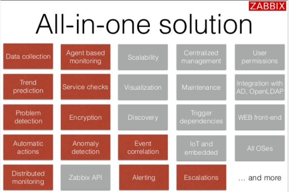

## Lợi ích của Zabbix
* Tất cả các nền tảng giám sát phổ biến nhất được gói gọn trong Zabbix
* **Miễn phí**- Là nền tảng mã nguồn mở được support toàn cầu 
* Dễ dàng sử dụng các dịch vụ thương mại nếu cần
* **GPL-2.0 License**- Không mất phí giấy phép 
* **TCO Low**- quá trình duy trì sử dụng ít tốn kém về chi phí
* **No vender lock in** - nhà cung cấp không bao giờ khóa

### Dễ dàng bảo trì
* Tất cả các thành phần đều tương thích trong một bản phát hành chính thức
* **Zabbix Agent** tương thích kể từ phiên bản Zabbix 1.0

## Kiến trúc của Zabbix
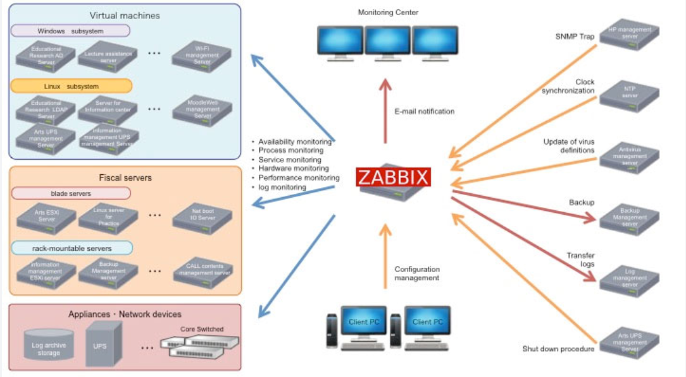

### Các mức của kiến trúc
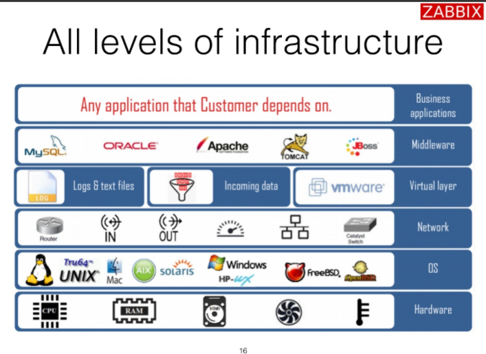
* **Layer Hardware**: Là phần cứng của máy chủ

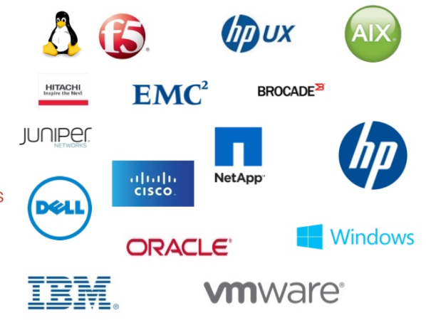
* **OS**: Zabbix hỗ trợ các hệ điều hành Unix, Linux, Mac, AIX(IBM), Solaris(SUn/Oracle), Window, FreeBSD, OpenBSD,...
* **Network**: Zabbix hỗ trợ giam sát các thiết bị có kết nối mạng
* **Virtual layer**:
* **Middleware**: Các phần mềm trung gian mà có thể giám sát
* **Business applications**: Các ứng dụng mà khách hàng phải phụ thuộc.

## Distributed environment

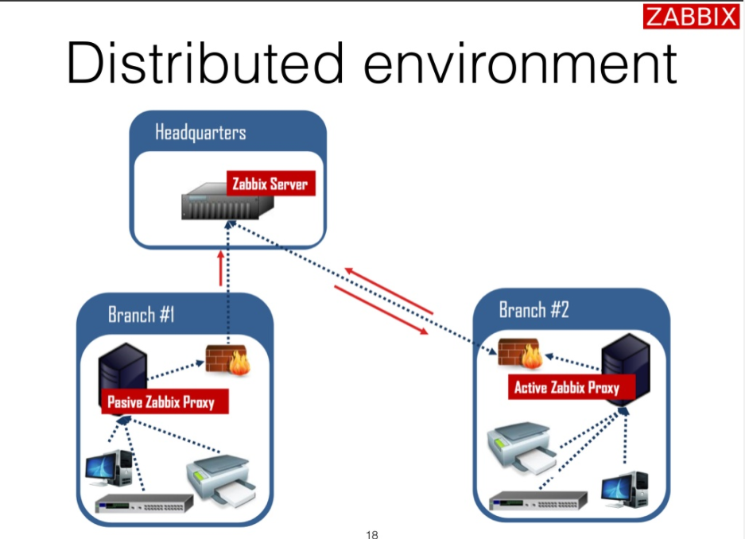

Zabbix cung cấp một cách hiệu quả và đáng tin cậy để giám sát hạ tầng CNTT Distributed bằng Zabbix Proxy.

Proxy có thể được sử dụng để sử dụng để thu thập dữ liệu cục bọ thay mặt cho Zabbix server và sau đó báo cáo dữ liệu cho máy chủ. Proxy có thể tự đảm bảo thu thập dữ liệu và giảm tải cho máy chủ Zabbix
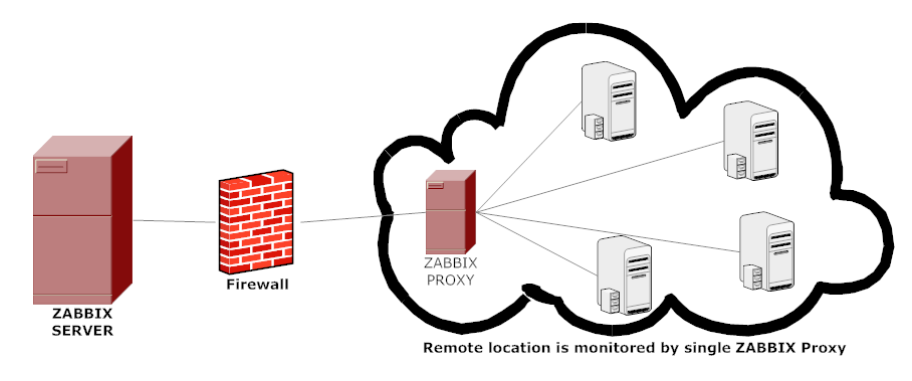

Một Proxy Zabbix có thể được sử dụng để:
* Vị trí từ xa được giám sát bởi 1 Zabbix Proxy.
* Giảm tải máy chủ Zabbix khi giám sát hàng nghìn thiết bị.
* Đơn giản hóa việc giám sát phân tán

Proxy chỉ yêu cầu một kết nối TCP với máy chủ Zabbix, như vậy việc sử dụng tường lửa sẽ dễ dàng hơn vì bạn cần cấu hình một quy tắc cho tường lửa
>**Chú ý**: Zabbix Proxy phải được sử dụng một cơ sở dữ liệu riêng biệt. Trỏ nó vào cơ sở dữ liệu máy chủ Zabbix sẽ bị phá vỡ cấu hình

## Giao thức thu thập dữ liệu

Có 2 phương pháp được Zabbix sử dụng để lấy thông tin từ các Agent: **Push** & **Pull**
### Pull 
* **Service checks:** HTTP, SSH, IMAP, NTP and other
* **Passive agent**: 
* Script execution ia SSH and Telnet
### Push
* Active check
* Zabbix Trapper and SNMP traps
* Monitoring of log file and event logs on windows

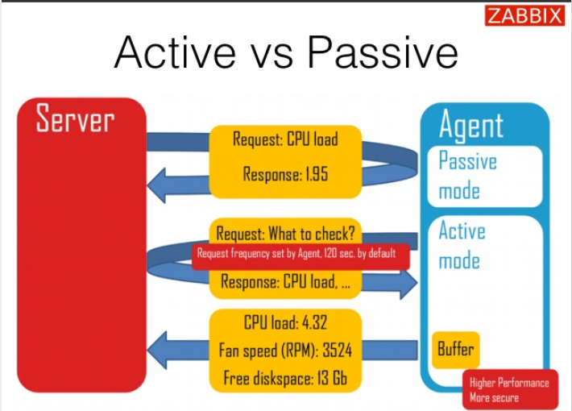

### Tần suất thực hiện kiểm tra
* Cứ mỗi N giây, down to 1 check per second 
    * Zabbix sẽ phân phối đồng đều kiểm tra
* Tuần suất khác nhau trong khoảng thời gian khác nhau - Different frequency in different time period
    * Mỗi X giây trong khoảng thời gian làm việc
    * Mỗi X giây trong vào cuối tuần
* Vào một thời điểm cụ thể
    * Sẵn sàng để kiểm tra công việc
    * Bắt đầu 9:00 giờ vào làm việc

## Mã hóa và xác thực
Mã hóa và xác thực mạnh mẽ cho tất cả các thành phần dựa trên TLS(Transport Layer Security- Bảo mật lớp Transport là một giao thức lớp Upper(ULP) chạy trên TCP. TLS cung cấp tính toàn vẹn và bảo mật của dữ liệu đầu cuối)

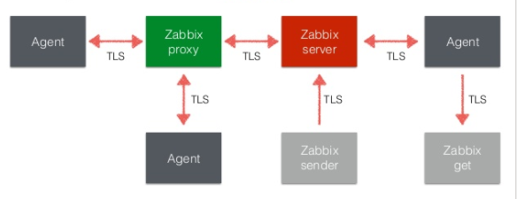

Nguồn tham khảo 
* [Zabbix](https://www.zabbix.com/documentation/)
* [SLIDESHARE](https://www.slideshare.net/Zabbix/alexei-vladishev-zabbix-monitoring-solution-for-everyone)