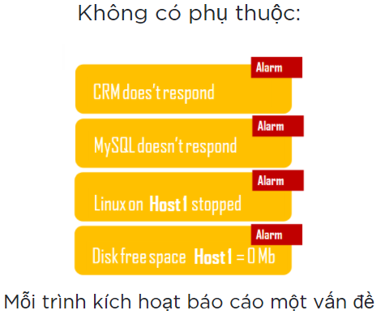
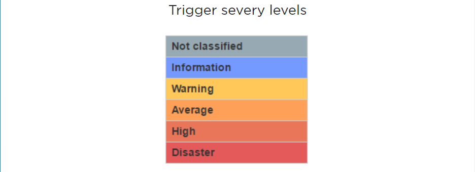

### Phát hiện có vấn đề

# Xác định ngưỡng thông minh

Ngay sau khi dữ liệu được thu thập, sử dụng các phương pháp khác nhau có sẵn trong Zabbix, quá trình đánh giá dữ liệu, hoặc biểu thức trigger expression, Zabbix cung cấp các định nghĩa logic về trạng thái sự cố cho dữ liệu nhận được từ các máy chủ được giám sát. Khi đặt đến ngưỡng kích hoạt, trigger thay đổi thay đổi trạng thái từ OK thành PROBLEM và cũng quay trở lại khi dữ liệu dưới ngưỡng

## Sự dự đoán 

Mặc dù rất tốt khi có các vấn đề được phát hiện, nhưng sẽ tốt hơn nếu có thể dự đoán vấn đề. Vì mục đích đó, các chức năng dự đoán có sẵn trong Zabbix. Zabbix phân tích xu hướng của dữ liệu đến và xây dựng dự báo về khả năng mọi thứ diễn ra như thế nào, mang đến cho người dùng khả năng chủ động hành động.

## Định nghĩa ngưỡng linh hoạt
Zabbix cung cấp cho người dùng các tùy chọn xác định ngưỡng thông minh, linh hoạt. Mặc dù ngưỡng cho các trình kích hoạt có thể đơn giản là "lớn hơn x" nhưng có thể sử dụng tất cả các biểu thức logic, chẳng hạn như phép chia, pháp nhân, không bằng nhau, logic AND và OR.

## Tham chiếu một hoặc nhiều mục hoặc máy chủ
Sử dụng nhiều Item khác nhau thu được từ các máy chủ khác để xây dựng biểu thức trigger. Điều này cho phép xây dựng các ngưỡng phức tạp, thông minh, giúp giảm thiểu các kết quả giả và do đó cho phép quản trị viên tập trung vào các vấn đề thực tế.
## Phân tích dữ liệu lịch sử
Kiểm tra trạng thái dữ liệu hiện tại so với trạng thái dữ liệu thu được một thời gian trước. Có thể so sánh các khoảng thời tương tự.

So sánh với chuẩn mực, trong đó chuẩn mực là trạng thái hệ thống trong quá khứ. Ví dụ: tải trung bihf của CPU trong giờ qua cao hơn 2 lần so với tải CPU trong cùng kỳ tuần trước.

## Hysteresis- Độ trễ
Là một chức năng quan trọng cho phép tránh hiện tượng Flapping có thể xảy ra khi dữ liệu đến dao động xunh quanh một ngưỡng đơn giản. Độ trễ có giới hạn trên và giới hạn dưới, đặt kích hoạt ở trạng thái có vấn đề khi đạt đến giới hạn trên và đưa trình kích hoạt về trạng thái bình thường khi dữ liệu thu được dưới ngưỡng.

## Dependencies- Sự phụ thuộc
Trong bất kỳ môi trường công nghệ thông tin nào cũng có rất nhiều yếu tố phụ thuộc, khi lỗi ở một nút sẽ gây ra lỗi hoạt động ở nhiều phần khác của môi trường. Sự phụ thuộc có thể phát triển đến nhiều cấp, khi thiếu dung lượng đĩa dẫn đến hệ điều hành mà CSDL đang chạy trên đó bị lỗi. Tại thời điểm này, người dùng CRM, CMS, NPMD và nhiều ứng dụng kinh doanh khác sẽ không thể thực hiện nhiệm vụ của họ. Một hệ thống giám sát không có cấu hình phụ thuộc sẽ tạo ra hàng chục hoặc hàng trăm thông báo và gửi hằng trăm nghìn Email thông báo về việc tất cả  các hệ thống nà đang ngững hoạt động

### Không có phụ thuộc

Vấn đề thực sự Disk đầy:

* Diều tra nguyên nhân thực sự của nhiều vấn đề
* Bỏ qua các thông báo phụ thuộc
* Ẩn các trình kích hoạt phụ thuộc trong giao diện người dùng

### Có sự phụ thuộc

Chỉ cần báo cáo các vấn đề gốc

## Severity levels - Mức độ nghiêm trọng
Xác định Mức độ nghiêm trọng của Trigger dựa trên mức độ quan trọng. Vì không phải tất cả các trình kích hoạt đều có cùng một mức độ quan trọng, một trong sáu mức độ nghiêm trọng có thể được chỉ định cho trigger. Sau đó, mức độ nghiêm trọng được áp dụng để thể hiện trực quan các yếu tố kích hoạt hoặc có thể được sử dụng để điều chỉnh phản ứng trước các sự kiện vấn đề.

### Mực độ nghiêm trọng được sử dụng cho :
* Trình bày trực quan các Triggers
* Âm thanh trong báo động chung
* Chọn kênh thông báo

