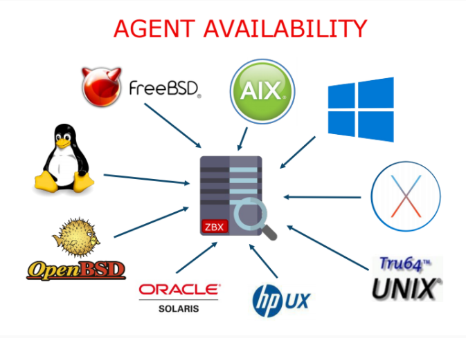

# METRIC COLLECTION
### 1. [Zabbix Agent](#Zabbix)

1.1 [Polling and trapping support](#Polling)

* 1.1.1 [Passive checks (polling)](#Passive)

* 1.1.2 [Active checks (trapping)](#Active)

1.2 [Agent functions](#functions)

1.3 [Extending Zabbix agent](#Extending)

1.4 [Log monitoring](#Log)

### 2. [Giám sát không cần Agent](#khong)
2.1 [Kiểm tra dịch vụ mạng](#tra)

2.2 [ICMP ping](#ICMP)

2.3 [Remote check](#Remote)

2.4 [Các dịch vụ mạng](#net)

2.5 [Kiểm tra TCP port](#port)

2.6 [ICMP ping](#ping) 

2.7 [SSH & Telnet](#SSH)
### 3. [SNMP and IPMI agents](#and)
3.1 [SNMP support](#MP)

3.2 [IPMI Agent](#MI)
### 4. [End user web monitoring](#web)
4.1 [Mô phỏng trải nghiệm người dùng](#user)

4.2 [Các chức năng được bổ sung](#sung)

4.3 [Được sử dụng các Templates](#Templates)
### Thu thập các Metric trong Zabbix

Bản chất của Zabbix, được phát triển trên ngôn ngữ lập trình C, có thể hỗ trợ trên các nền tảng khác nhau. Đồng thời thu thập dữ liệu như mức sử dụng CPU, Memory, Disk, Network interface sử dụng từ một thiết bị.

## Passive (polling) and Active checks (trapping) Support 
Zabbix thực hiện kiểm tra dựa trên thời gian, cũng có thể lên lịch thời gian cự thể.

### Passive Check (polling)
* Zabbix server (hoặc Proxy) yêu cầu cầu các giá trị từ Zabbix agent
* Agent xử lý yêu cầu và trả về giá trị cho Zabbix

### Active checks (trapping)
* Zabbix agent yêu cầu từ Zabbix một danh sách Active checks cho agent, để agent chủ động kiểm tra hoạt động của danh sách mà Zabbix đưa ra.
* Agent gửi kết quả theo định kỳ cho Zabbix

# Chức năng của Agent
|Device|Agent|Ghi chú|
|-|-|-|
|Network|Packet/bytes transfered||
||Errors/dropped packets||
||Collisions||
|CPU|Load average||
||CPU idle/usage||
||CPU utilization data per individual process||
|Memory|Free/used memory|RAM đã sử dụng và trống|
||Swap/pagefile utilization||
|Disk|Space free/used|Dung lượng disk|
||Read and write I/O||
|Service|Process status|Trạng thái các Process đang hoạt động|
||Process memory usage|Các Process đang sử dụng bộ nhớ ram|
||Service status|Giám sát các dịch vụ như http, ssh , ntp, mysql, ftp,...|
||Windows service status|Giám sát các trạng thái dịch vụ của Window|
||DNS resolution||
||TCP connectivity|Các kết nối TCP|
||TCP response time|Thời gian phản hồi TCP|
|File|File size/time|Thời gian sử dụng và kích thước của Fiole|
||Exits|Sự tồn tại của file|
||Checksum|Sự thay đổi của file|
||MD5 hash||
||RegExp search||
|Log|Text log||
||Window Eventlog||
|**Khác**|Thời gian hoạt động của hệ thống||
||Giờ hệ thống||
||Người dùng đã kết nối||
||Bộ đếm hiệu suất(window)||

## Log Monitoring
Hỗ trợ giám sát ký tự log và Window Event Log là một chức năng của Zabbix Agent

Có thể vẽ biểu đồ dữ liệu từ các log items,khi khả năng trích xuất nội dung cụ thể được sử dụng

Log được Zabbix agent phân tích liên tục và khi một mục tìm kiếm xác định được tìm thấy, Zabbix được thông báo và thực hiện một số hành động hoặc tự động gửi thông báo đến người dùng hoặc nhóm

# Giám sát không cần Agent
Mặc dù Zabbix cung cấp các tính năng tuyệt vời trên hầu hết các nền tảng, nhưng trong một số trường hợp, bạn không thể cài đặt nó. Trong một số trường hợp nó không cần Agent.

## Các trức năng không cần Agent

### Kiểm tra dịch vụ mạng
* Tính khả dụng của TCP port 
* Thời gian phản hồi TCP port(response time)
* Service check

### ICMP ping
* Tính khả dụng của Server 
* Thời gian phản hồi của ICMP
* Packet loss

### Remote check
* Thực thi lệnh qua SSH hoặc Telnet

### Các dịch vụ mạng
Máy chủ Zabbix có thể kiểm tra một số dịch vụ mạng có đang **Listen** trên một port hay khôn gvaf cũng kiểm tra xem nó có phản hồi dúng cách hay không. Phương thúc này thiện được hỗ trợ cho các dịch vụ sau: FYP, IMAP, HTTP, HTTPS LDAP, NNAP, POP3, SMTP, SSH, TCP và telnet

### Kiểm tra TCP port 
Đối với các trượng hợp không được xử lý bởi mục trước, máy chủ Zabbix có thể kiểm tra xem có thứ gì đó đang lắng nghe trên cổng TCP hay không, thông báo nếu có dịch vụ hay không

### ICMP ping 
Zabbix có thể kiểm tra xem máy chủ có phản hồi các gói ping ICMP hay không. Có thể kiểm soát tính khả dụng của một máy chủ, cũng như thời gian phản hồi và mất gói.

Có thể tùy chỉnh các thiết lập kích thước và số lượng gói, thời gian chờ và độ trễ giữa mỗi gói.

### SSH & Telnet

# SNMP and IPMI
* SNMP (*Simple Network Management Protocol*) là một **tập hợp** các **giao thức** không chỉ cho phép **kiểm tra** các thiết bị mạng như **router**, **switch** hay **server** có đang vận hành mà còn hỗ trợ vận hành các thiết bị này một cách tối ưu, ngoài ra SNMP còn cho phép **quản lý** các **thiết bị mạng từ xa**.

* Intelligent Platform Management Interface- Giao diện quản lý nền tảng thông minh là một bộ các đặc tả giao diện máy tính cho một hệ thống con máy tính tự trị, cung cấp khả năng quản lý và giám sát độc lập với CPU, chương trình cơ sở và hệ điều hành của hệ thống máy chủ.

## SNMP support 
Một máy chủ Zabbix có thể thu thập dữ liệu từ thiết bị bằng SNMP v1, v2 hoặc v3. SNMP agent có thể thu thập dữ liệu của máy in, NAS, UPS. Về cơ bản bất kỳ thiết bị nào có trên môi trường Internet đều có thể được giám sát thông qua SNMP.

## IPMI Agent

Dùng để lấy dữ liệu quan trọng từ phần cứng, máy chủ Zabbix hỗ trợ các IPMI, được hiển thị theo mặc định trên các máy chủ kiến trúc Intel như HP iLO và Dell DRAC.

Các mục có sẵn thông qua các IPMI agnet khác nhau ở mỗi phần cứng, nhưng đây là những mục phổ biến nhất:
* Nhiệt độ của CPU và nhiệt độ của Vỏ máy
* Tốc độ quạt
* Điện áp của hệ thống
* Trạng thái của Disk vật lý
* Trạng thái hiện thị của LED bảo trì

# Tính toán thông tin và tổng hợp thông tin
## Calculated Items - các mục được tính toán

# Kịch bản Web 
Zabbix cung cấp chức năng giám sát eerb linh hoạt và hiệu quả, trong đó module web thường xuyên thực hiện các kịch bản được xác định trước và lưu trữ kết quả thu được.

Các giá trị được lưu trữ đối với mỗi bước của kịch bản
* Download speed
* Response time
* Response code
* Xuất hiện một chuỗi kết quả

## Mô phỏng trải nghiệm người dùng
Kịch bản web được tạo ra bởi một hoặc nhiều yêu cầu HTTP(steps), có thể kiểm tra chức năng của ứng dụng web, đảm bảo trải nghiệm người dùng tích cực.

Trong quá trình thực hiện các bước, cookie được duy trì để đảm bảo giám sát hiệu quả.

## Các chức năng được bổ sung
* User variables 
* Retries 
* Theo tùy chọn Theo dõi chuyển hướng
* Phương thức GET & POST
* Giao thức HTTP và HTTPS
* Tiêu đề HTTP tùy chỉnh
* Xác thực cơ bản
* NTLM authentication
* Xác minh và xác thực SSl

## Được sử dụng các Templates

Đôi khi cần phải thu thập số liệu thoongskee tương tù một số lượng lớn các dịch vụ web, chăng hạn như nhomsmays chủ web phía sau bộ cân bằng tải. Để tự động hóa tác bụ kịch bản web có thể là thành viên mẫu và có thể được áp dụng cho nhiều máy chủ theo yêu cầu, với các biến đucợ hỗ trợ trông tên kịch bản URL và các trường khác.

